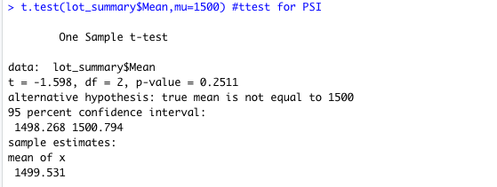

# MechaCar_Statistical_Analysis
## Linear Regression to Predict MPG
To consider potentially contributing factors to vehicle MPG, linear regression model and summary function were utilized given the dataset containing values for MPG, vehicle length, vehicle weight, spoiler angle, ground clearance, and AWD.
Linear Regression Model output:

Summary output:

- Based on these outputs, three variables (vehicle length, ground clearance, and AWD) provide a non-random amount of variance to the mpg variable given their p-scores (Pr(>Itl)) were less than/equal to 0.05, rejecting a null hypothesis. 
- Two variables measured p-scores of greater than/equal to 0.05 (vehicle weight and spoiler angle), which fail to reject the null hypothesis and have a random amount of variance to mpg variable.
- The slope of this linear model is not zero since some independent variables do demonstrate a linear relationship (versus random, which would be a slope of zero). The model p-value of 5.25e-11 (or 0.0000000000535) is much less than the assumed significance of 0.05, further confirming the slope is not zero.
- This linear model has a greater-than-random likelihood of predicting MPGs for prototypes - the r-squared score of 0.7149 approximates that 71% of predictions using this model would be correct.

## Summary Statistics on Suspension Coils
Looking specifically at MechaCar suspension coil data, three lots were analyzed to consider specifications that variance of suspension coils not exceed 100 pounds per square inch (PSI). Analysis of all lots combined confirms that the dataset is within those specifications with a variance of 76.23459

In considering each lot, however, Lot3 is beyond those specifications with a variance of 220.010563. Lot1 & Lot2 are well within the specifications with a variance of 1.146024 & 10.131511 respectively).

## T-Tests on Suspension Coils
Based on the results of the t-Test, all manufactoring lots are statistically similar from the population mean of 1,500 PSI (the t-Test p-value of 0.2511 is > 0.05).

In considering each manufacturing lot individually against the population mean of 1,500 PSI, all 3 Lots are statistically similar to the population mean of 1,500 PSI although they do measure different p-scores (all above 0.05). 
Lot 1 is also statistically similar (p-value 0.9048).

Lot 2 is statistically similar to the population mean (p-value 0.3451). 

Lot 3 is also statistically similar to the population mean (p-value 0.637).

